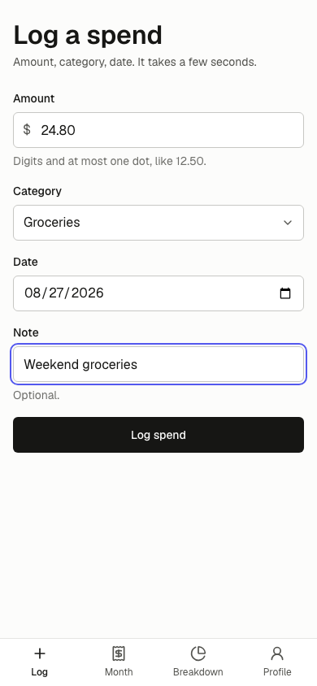
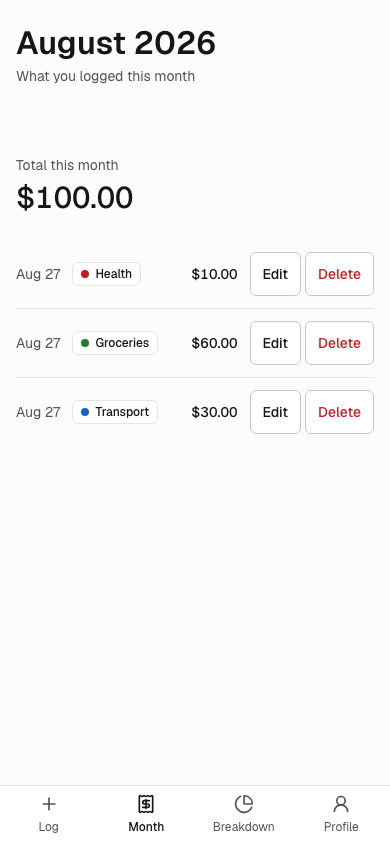
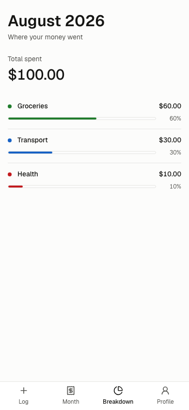
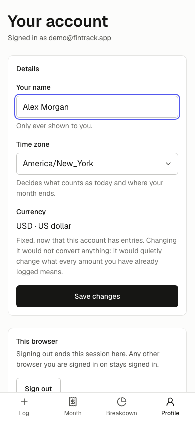

<div align="center">

# FinTrack

### Know where the month went.

A focused personal money tracker for logging everyday spending, reviewing the
month, and understanding which categories took the most.

[**Open the live app**](https://fintrack-eight-sand.vercel.app) ·
[**Explore the roadmap**](docs/scope/scope.md) ·
[**Report an issue**](https://github.com/ddevv15/fintrack/issues)

[](https://github.com/ddevv15/fintrack/actions/workflows/ci.yml)
[](https://nextjs.org/)
[](https://www.typescriptlang.org/)
[](https://fintrack-eight-sand.vercel.app)
[](LICENSE)

</div>

## About FinTrack

FinTrack is built around one simple routine: log a spend, put it in a category,
and see where your money went this month. It deliberately keeps the product
small and the numbers trustworthy—no crowded dashboard, no floating-point
money maths, and no silently incomplete totals.

The current release is a complete, usable first slice. It includes private
accounts, fast spend entry, a monthly transaction list, and a category
breakdown. The project is developed in thin, shippable releases; the longer-term
direction is documented in the [project scope](docs/scope/scope.md).

## See FinTrack in action

|                                                                             Log a spend                                                                              |                                                                       Review the month                                                                       |
| :------------------------------------------------------------------------------------------------------------------------------------------------------------------: | :----------------------------------------------------------------------------------------------------------------------------------------------------------: |
|   [](https://fintrack-eight-sand.vercel.app/transactions/new)   | [](https://fintrack-eight-sand.vercel.app/transactions) |
|                                                                     **Understand the breakdown**                                                                     |                                                                   **Manage your account**                                                                    |
| [](https://fintrack-eight-sand.vercel.app/breakdown) |  [](https://fintrack-eight-sand.vercel.app/settings)  |

## What you can do

- Create an account with email and password or Google, verify your email, and
  recover a forgotten password.
- Choose your currency and timezone so amounts and month boundaries reflect
  your own settings.
- Log a spend with an amount, category, date, and optional note.
- Review the current month newest-first, with an exact running total.
- Edit mistakes or delete duplicate transactions.
- See spending grouped by category, ranked from largest to smallest, with
  percentage shares that always add up to 100%.
- Use the app comfortably on mobile or desktop, in light or dark mode, with
  keyboard and screen-reader-friendly controls.
- Update your profile, change your password, sign out, or permanently delete
  your account.

## Why the numbers are trustworthy

Financial software should fail honestly. Several architectural rules make that
principle concrete in FinTrack:

- **Exact money:** amounts are stored as integer minor units—the smallest unit
  a currency supports. Parsing happens from strings without floating-point
  multiplication or silent rounding.
- **One definition of a month:** the transaction list and category breakdown
  share the same timezone-aware month window, spend filter, and completeness
  check.
- **No partial totals:** every monthly read is checked against the database's
  row count. If the app cannot prove that a result is complete, it shows an
  error instead of a figure that may be wrong.
- **Private by default:** every table containing personal data has Postgres row
  level security tied to the signed-in user.
- **Server-first rendering:** account data and monthly calculations stay on the
  server wherever the browser does not need them.
- **Accessible foundations:** semantic HTML, visible focus states, 44px minimum
  targets, reduced-motion support, and automated axe checks target WCAG 2.2 AA.

## Tech stack

| Layer       | Technology                                                                                                                         |
| ----------- | ---------------------------------------------------------------------------------------------------------------------------------- |
| Application | [Next.js 16](https://nextjs.org/) App Router, [React 19](https://react.dev/), strict [TypeScript](https://www.typescriptlang.org/) |
| Styling     | [Tailwind CSS 4](https://tailwindcss.com/) with a custom token-based design system                                                 |
| Backend     | [InsForge](https://insforge.dev/) Auth and Postgres through `@insforge/sdk`                                                        |
| Validation  | [Zod 4](https://zod.dev/)                                                                                                          |
| Security    | Postgres row level security and optional [Arcjet](https://arcjet.com/) attempt limiting                                            |
| Testing     | [Vitest](https://vitest.dev/), [Playwright](https://playwright.dev/), and [axe-core](https://github.com/dequelabs/axe-core)        |
| Delivery    | [GitHub Actions](https://github.com/ddevv15/fintrack/actions) and [Vercel](https://vercel.com/)                                    |

There is no ORM. The database schema is defined in plain SQL migrations, and
runtime rows are validated at the boundary with Zod.

## Getting started

### Prerequisites

- Node.js 22
- npm
- An [InsForge](https://insforge.dev/) project
- The InsForge CLI authenticated and linked to that project

### 1. Clone and install

```bash
git clone https://github.com/ddevv15/fintrack.git
cd fintrack
npm install
```

### 2. Configure the environment

Copy the documented environment template:

```bash
cp .env.example .env.local
```

Fill in the required values in `.env.local`:

| Variable                        | Purpose                                                           |
| ------------------------------- | ----------------------------------------------------------------- |
| `NEXT_PUBLIC_INSFORGE_URL`      | The URL of your InsForge project                                  |
| `NEXT_PUBLIC_INSFORGE_ANON_KEY` | The browser-safe anonymous project key                            |
| `APP_URL`                       | The app origin, such as `http://localhost:3000`                   |
| `APP_CURRENCY`                  | Currency preselected during account setup, such as `USD`          |
| `APP_TIMEZONE`                  | Fallback timezone suggested during account setup                  |
| `ARCJET_KEY`                    | Optional attempt limiting for authentication flows                |
| `UI_GALLERY`                    | Optional; set to `1` to expose the component gallery at `/design` |

`APP_CURRENCY` and `APP_TIMEZONE` are setup suggestions only. Once signed in,
each person's saved profile is the source of truth.

### 3. Apply the database migrations

After linking the InsForge CLI to your project, apply every migration:

```bash
npx @insforge/cli db migrations up --all
```

The migrations create the profile, category, currency, and transaction schema;
enable row level security; and seed ten starter categories for each new account.
See [the migration guide](docs/migrations.md) before changing the schema.

### 4. Run the app

```bash
npm run dev
```

Open [http://localhost:3000](http://localhost:3000). Create an account, complete
the currency and timezone setup, and log your first spend.

## Available commands

| Command                    | What it does                                                |
| -------------------------- | ----------------------------------------------------------- |
| `npm run dev`              | Starts the development server                               |
| `npm run build`            | Creates a production build                                  |
| `npm run start`            | Serves the production build                                 |
| `npm run lint`             | Runs ESLint                                                 |
| `npm run format:check`     | Checks formatting with Prettier                             |
| `npm run typecheck`        | Generates Next.js route types and checks TypeScript         |
| `npm run test`             | Runs the offline Vitest unit suite                          |
| `npm run test:integration` | Tests the schema and row level security against InsForge    |
| `npm run test:e2e`         | Runs browser flows and accessibility checks with Playwright |

The signed-in integration and end-to-end suites use two isolated test accounts.
Their optional credentials are documented in [.env.example](.env.example) and
[the migration guide](docs/migrations.md). Without those credentials, the
offline and public browser suites still run, while the signed-in suites report
that they were skipped.

## Project structure

```text
app/                 Next.js routes, layouts, and route handlers
actions/             Server actions for auth, settings, and transactions
components/
  auth/              Authentication and account setup forms
  breakdown/         Monthly category breakdown UI
  settings/          Profile and account controls
  transactions/      Spend entry and transaction management
  ui/                Shared accessible UI primitives
lib/                 Money, time, data access, validation, and domain logic
migrations/          Ordered SQL schema migrations
tests/
  unit/              Pure, offline logic tests
  integration/       Live database contract and RLS tests
  e2e/               Playwright user flows and axe checks
docs/                Specs, design rules, reviews, and the product roadmap
```

Key project decisions are recorded as numbered specs in
[`docs/specs`](docs/specs). The visual language and component contract live in
[`docs/design.md`](docs/design.md).

## Deploying to Vercel

FinTrack is designed for Vercel and is currently running at
[fintrack-eight-sand.vercel.app](https://fintrack-eight-sand.vercel.app).

To deploy your own instance:

1. Create and migrate an InsForge project.
2. Import this repository into Vercel.
3. Add the required environment variables from `.env.example`.
4. Set `APP_URL` to the final HTTPS origin with no trailing slash.
5. Allow the corresponding auth callback URL in InsForge if you enable Google
   sign-in.
6. Deploy, then verify sign-up, email delivery, and authentication redirects
   against the production domain.

Keep admin keys and test-account credentials out of client-visible environment
variables. The application itself only uses the browser-safe InsForge anonymous
key.

## Roadmap

Release 1 is complete: account access, spend logging, monthly transactions, and
the category breakdown are live. Planned releases include:

- Categories you manage
- Search and filtering
- Export and backup
- Category budgets
- Income tracking
- Recurring bills and subscriptions
- Trends across months
- Accounts and balances
- Receipt capture and bank connections

The detailed status, release order, and acceptance criteria live in
[`docs/scope/scope.md`](docs/scope/scope.md).

## Contributing

Thoughtful issues and pull requests are welcome.

1. Fork the repository and create a focused branch.
2. Read [`AGENTS.md`](AGENTS.md), the relevant feature spec, and
   [`docs/design.md`](docs/design.md) before changing behavior or UI.
3. Keep money conversion in `lib/money.ts`, month reads in `lib/month.ts`, and
   environment access in `lib/env.ts`.
4. Add or update tests for the behavior you change.
5. Run the local quality gate:

   ```bash
   npm run format:check
   npm run lint
   npm run typecheck
   npm run test
   npm run build
   ```

6. Open a pull request that explains the problem, the chosen approach, and how
   you verified it.

Please do not include real financial data, credentials, or session files in an
issue, test fixture, screenshot, or commit.

## License

FinTrack is open-source software licensed under the [MIT License](LICENSE).
You may use, copy, modify, merge, publish, distribute, sublicense, and sell
copies of the software, provided the copyright and license notice are retained.

---

<div align="center">

Built for a clear answer to a small but important question: **where did the
money go?**

</div>
